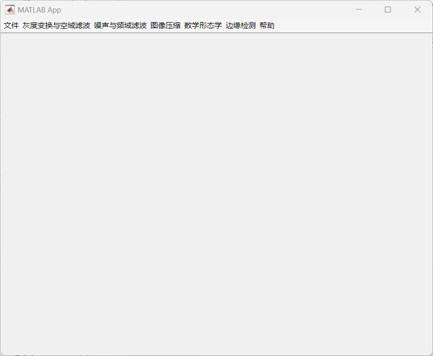

# min_DIPapp

这是一个用 MATLAB 设计并打包的DIP小程序，用于整合数字图像处理课程实验的内容。

## [matlab代码](https://github.com/youlengyue/min_DIPapp/blob/main/app1.mlapp\)

## 软件展示效果

## 软件启动界面

## my_DIP[使用说明](https://github.com/youlengyue/min_DIPapp/main/for_redistribution_files_only/help.txt)

## 如何运行程序

- 如果电脑上有 MATLAB 环境，直接运行 `for_redistribution_files_only` 里的 `my_mine.exe` 文件即可运行程序。
- 如果没有 MATLAB 环境，首先需要安装 `for_redistribution` 里的 `MyAppInstaller_mcr.exe`（建议安装到全新的文件夹里，因为卸载该软件时会把文件夹清空），然后再进行上面步骤即可。

更多操作详情，请参考[这个链接](http://t.csdnimg.cn/pMfYU)。
